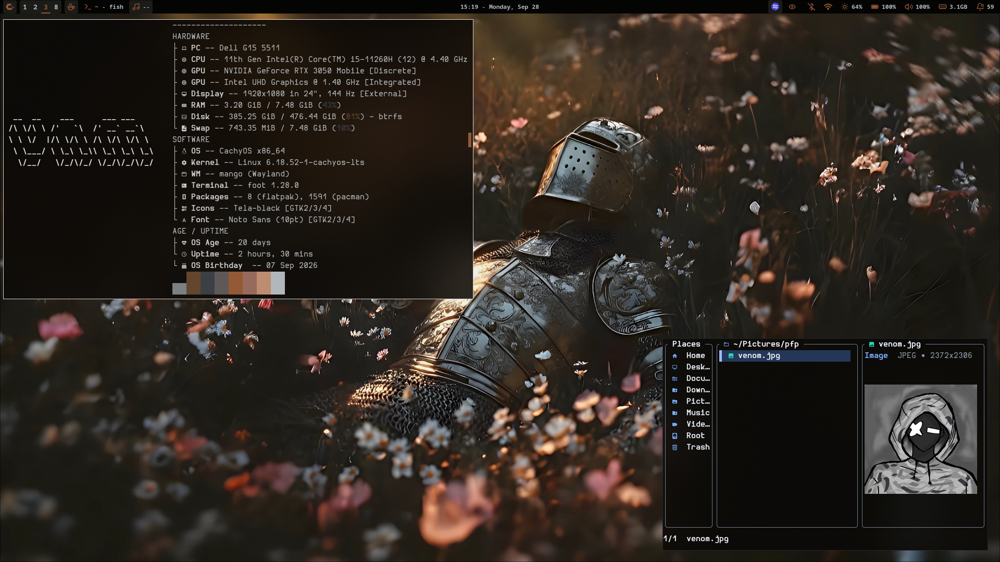
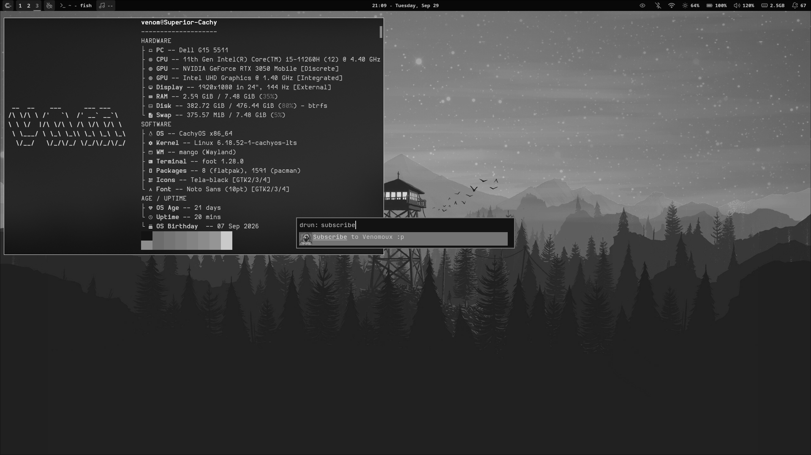
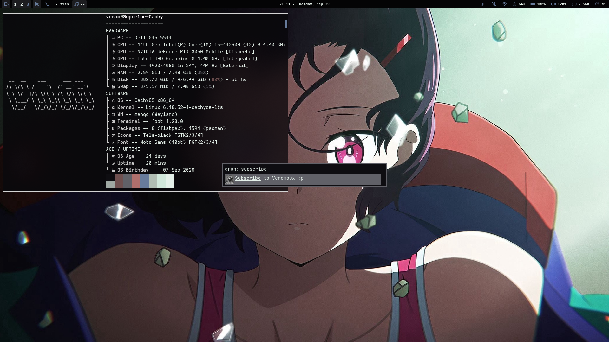
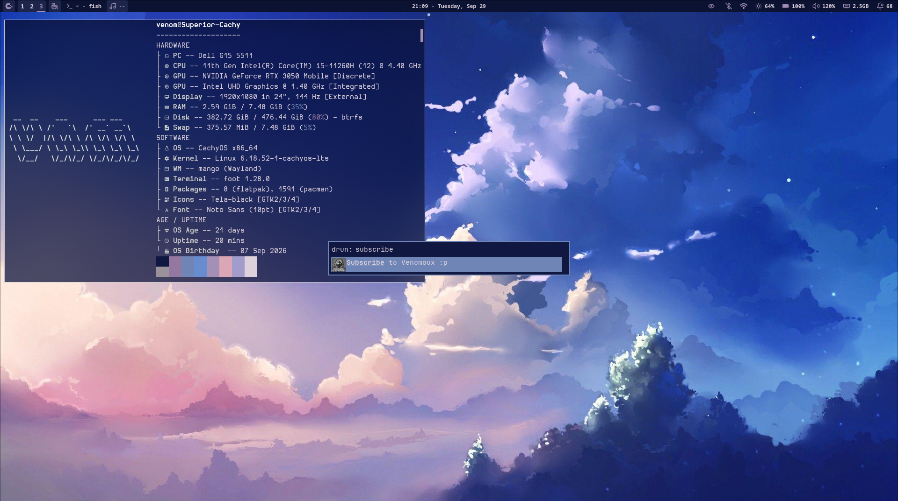
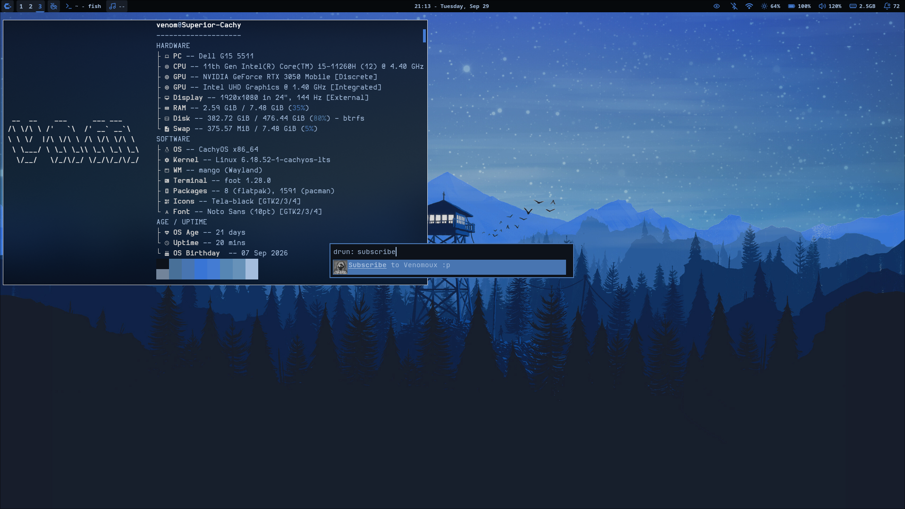
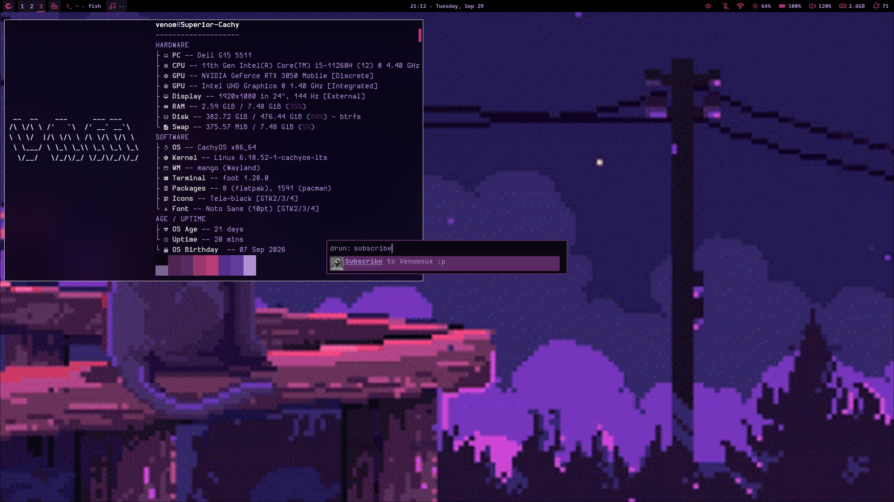
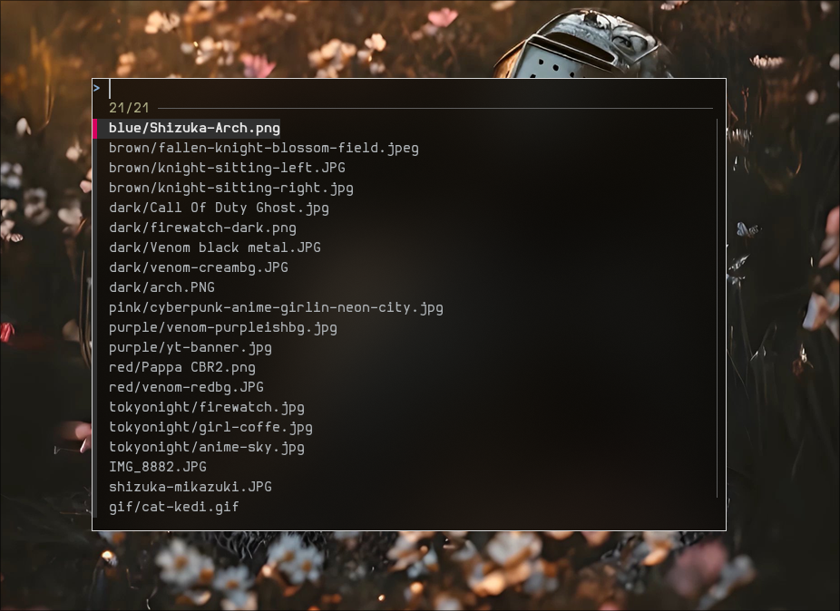
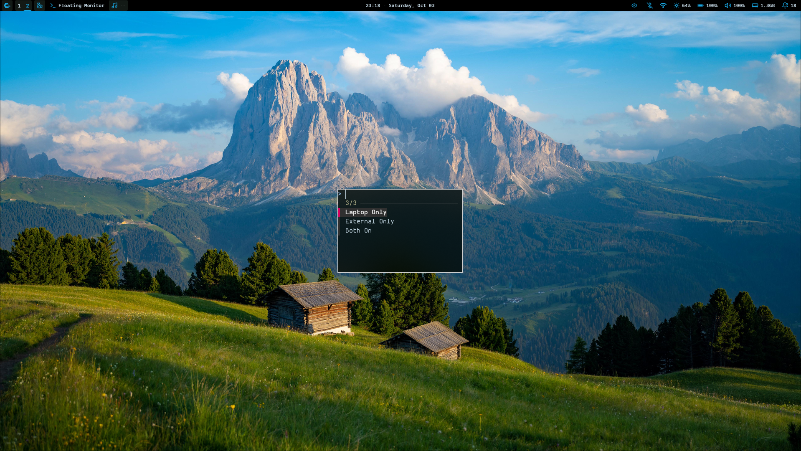
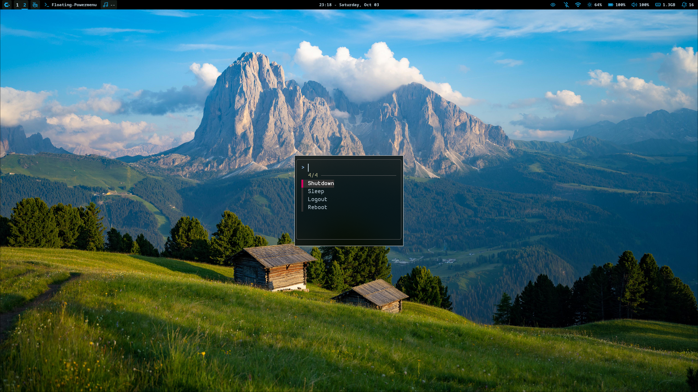
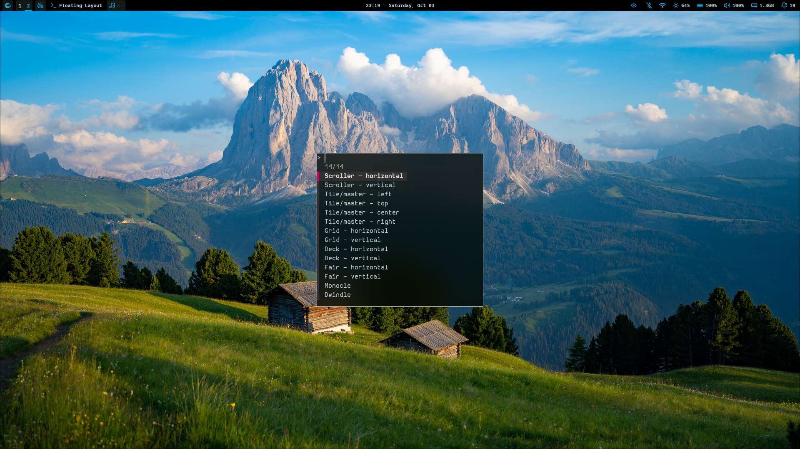

<h1 align="center">【 venomous's dotfiles 】</h1>

## [Join Fluxer Server](https://fluxer.gg/NkvInTZn)

# A Simple Personal setup of MangoWM 

---

## Stuff I like about this setup
* **Wayle Shell:** Comes with a GUI to setup and the status-bar got clickable buttons.
* **Bash Scripts:** I made a couple of bash scripts for stuff like changing wallpaper, managing monitors, powermenu.
* **Pywal:** Terminal, Wayle shell, and Rofi changes it's color based on wallpaper.
* **Stow Managed:** Damn it's easy to manage dotfiles using Stow. Stow is used to symlink dotfiles from your folder (where you store your dotfiles) into the respective application's configuration directories.
---

## Preview


### 🎨 Pywal for Status bar, Terminal, and Rofi
<div style="display: flex; gap: 10px;">
  
  
  
  
</div>

<div align="center">
  
</div>

### </> Bash Scripts
<div style="display: flex; gap: 10px;">
  
  
  
  
</div>


---

## Softwares
Since this is my personal setup, I'm going to list every software/dependency I use. Download only what you need :3<br>Don't forget to replace keybinds for *Optional* software with the ones you use.

| Category | Name | Description | Need |
|---|---|---|---|
| **Compositor** | [MangoWM](https://mangowm.github.io/) | - | **Ofcourse you need it, it's the WM** |
| **Symlink** | [GNU Stow](https://www.gnu.org/software/stow/) | - | **Required** |
| **Status Bar** | [Wayle](https://wayle.app/guide/getting-started) | - | **Required** |
| **Wallpaper Engine** | [awww](https://codeberg.org/LGFae/awww) | - | **Required** |
| **App Launcher** | [Rofi-Wayland](https://github.com/lbonn/rofi) | - | **Required** |
| **Color Generation** | [Pywal](https://github.com/dylanaraps/pywal) | - | **Required** |
| **Brightness Control** | [brightnessctl](https://github.com/Hummer12007/brightnessctl) | - | **Required** |
| **Screenshot** | [grim](https://gitlab.freedesktop.org/emersion/grim) | - | **Required** |
| **Screenshot Editor** | [satty](https://github.com/gabm/satty) | - | **Required** |
| **Screenshot Selection** | [slurp](https://gitlab.freedesktop.org/emersion/slurp) | - | **Required** |
| **Idle Manager** | [swayidle](https://github.com/swaywm/swayidle) | - | **Required** |
| **XDG Utilities** | [xdg-utils](https://gitlab.freedesktop.org/xdg/xdg-utils) | - | **Required** |
| **XDG Portal** | [xdg-desktop-portal-wlr](https://github.com/emersion/xdg-desktop-portal-wlr) | - | **Required** |
| **Audio** | [PipeWire](https://pipewire.org/) | - | **Required** |
| **Terminal** | [Foot](https://codeberg.org/dnkl/foot.git) | - | Optional |
| **File Manager** | [Thunar](https://docs.xfce.org/xfce/thunar/start) | - | Optional |
| **File Manager** | [Elio](https://elio-fm.github.io/) | - | Optional |
| **Code Editor** | [Neovim](https://neovim.io/) | - | **Optional** |
---

## Installation

### 1. Install Dependencies

Install everything listed in the [Install These](#-Install-These-:P) table manually for now — some packages live in the official repos (`pacman`) and others in the AUR (`yay`/`paru`).

> 🦥 I'm too lazy to write out a full install command right now — might add a proper install script in the future. For now, go through the table above and install each package manually.<br>
Will proly make a install script in future...

### 2. Back Up Existing Configs

> ⚠️ **Why this step matters:** GNU Stow will **not** overwrite files that already exist at the target location. If you already have configs in `~/.config/`, Stow will detect the conflict and simply refuse to symlink — without doing anything. Move your existing configs out of the way first so Stow has a clean target to symlink into.

### 3. Clone the Repository

```bash
git clone https://codeberg.org/Venomous27/superior-mango-dotfiles.git ~/superior-mango-dotfiles
cd ~/superior-mango-dotfiles
```
### 4. Symlink using Stow
> **⚠️ Note on Themes & Icons Folders:**
> I haven't included the `gtk-themes` and `icons` folders in the Stow command because they contain my actual theme files like the icons and themes I downloaded from the internet. So **just back-up your existing themes and icons first, delete your old folders, and then run Stow to link these. Then you can copy your custom themes and icons into the new (symlinked) folders.**
> Pipewire not included as well. It contains Noise Removal Plugin
```bash
stow mango foot scripts wayle swayidle rofi elio nvim pywal fastfetch
```
### 5. Make Scripts Executable 
> Do this for all the scripts
```bash
chmod +x ~/superior-mango-dotfiles/scripts/wallpaper.sh 
```

### 6. Verify & Launch

Reload Mango (or reboot), then confirm everything loaded:

```bash
mmsg dispatch reload_config
```
# Credits
<br>Layout Switcher: https://github.com/SDG-Den </br>
